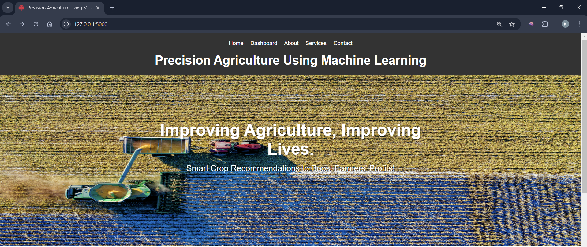
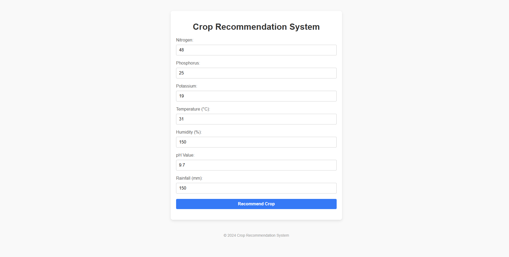
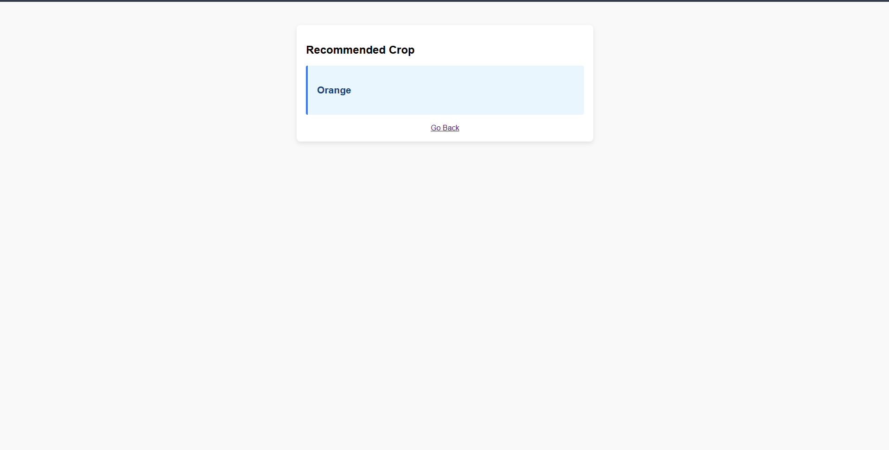
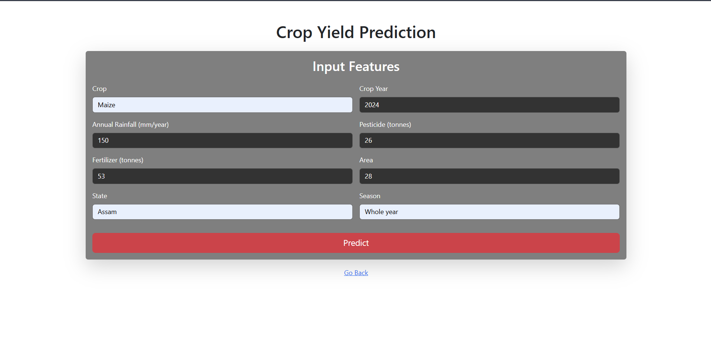

# 🌾 Precision Agriculture using Machine Learning

> A web-based machine learning application that recommends suitable crops and predicts crop yield using agricultural datasets through an intuitive Flask interface.


---

## 📖 Project Overview

Agricultural decision-making depends on several environmental and soil factors. Selecting the most suitable crop and estimating its expected yield can be challenging without reliable data-driven insights.

This project is a Flask-based web application that applies machine learning models trained on agricultural datasets to assist users in two primary tasks:

- 🌱 Recommend suitable crops based on soil and environmental parameters.
- 🌾 Predict crop yield using agricultural input data.

By combining both functionalities into a single platform, the application provides an intuitive interface for generating predictions and demonstrates the practical application of machine learning in precision agriculture.

---

## ✨ Key Features

- 🌱 **Crop Recommendation**
  
Recommends the most suitable crop based on soil nutrients and environmental conditions such as Nitrogen (N), Phosphorus (P), Potassium (K), temperature, humidity, pH, and rainfall.

- 🌾 **Crop Yield Prediction**
  
  Predicts crop yield using machine learning models trained on agricultural datasets.

- 🤖 **Machine Learning-Based Predictions**
  
  Generates predictions using trained machine learning models based on user-provided agricultural parameters.

- 🖥️ **Interactive Web Application**
  
  Built with Flask to provide a simple, responsive, and user-friendly interface for making predictions.

- 📊 **Agricultural Dataset Processing**
  
  Utilizes preprocessed agricultural datasets to train and evaluate machine learning models.

- 🔄 **Integrated Prediction Platform**
  
  Combines crop recommendation and crop yield prediction into a single application for a seamless user experience.

---
## 📸 Application Preview

### 🏠 Home Page



---

### 🌱 Crop Recommendation

**Input Form**


**Additional Input Parameters**



**Prediction Result**



---

### 🌾 Crop Yield Prediction

**Input Form**



**Prediction Result**


---

### 🛎️ Services


---

## 🛠️ Tech Stack

| Category | Technologies |
| :-------- | :----------- |
| **Programming Language** | Python |
| **Backend Framework** | Flask |
| **Machine Learning** | Scikit-learn |
| **Data Processing** | Pandas, NumPy |
| **Frontend** | HTML5, CSS3, JavaScript, Bootstrap |
| **Model Serialization** | Pickle |
| **Development Tools** | Jupyter Notebook, VS Code |
| **Version Control** | Git & GitHub |

---

## 🏗️ System Architecture

```text
                    User
                      │
                      ▼
          Flask Web Application
                      │
         ┌────────────┴────────────┐
         ▼                         ▼
Crop Recommendation        Crop Yield Prediction
         │                         │
         ▼                         ▼
 Machine Learning Models (Scikit-learn)
         │
         ▼
   Prediction Generation
         │
         ▼
 Display Results to User
```

The application accepts user-provided agricultural parameters through a Flask-based web interface. Based on the selected module, the input data is processed by the corresponding machine learning model, and the prediction is displayed to the user in real time.

---
## 📂 Project Structure

```text
precision-agriculture-ml/
│
├── 📄 app.py                    # Main Flask application
├── 📁 crop_recommendation/      # Crop recommendation module
├── 📁 yield_prediction/         # Crop yield prediction module
├── 📁 data/                     # Datasets used for training and prediction
├── 📁 docs/                     # Project documentation and report
├── 📁 graphs/                   # Graphs and visualizations
├── 📁 screenshots/              # Images used in the README
├── 📁 static/                   # CSS, JavaScript, and static assets
├── 📁 templates/                # HTML templates
├── 📄 README.md                 # Project documentation
```
---

### 🔗 Quick Navigation

| Resource | Description |
| :--- | :--- |
| [`app.py`](./app.py) | Main Flask application |
| [`crop_recommendation/`](./crop_recommendation) | Crop recommendation module |
| [`yield_prediction/`](./yield_prediction) | Crop yield prediction module |
| [`data/`](./data) | Agricultural datasets |
| [`docs/`](./docs) | Project report and documentation |
| [`graphs/`](./graphs) | Graphs and visualizations |
| [`templates/`](./templates) | HTML templates |
| [`static/`](./static) | Static assets (CSS, JavaScript, Images) |
| [`screenshots/`](./screenshots) | Application screenshots |

---

## ⚙️ Installation

Follow these steps to set up the project locally.

### 1. Clone the repository

```bash
git clone https://github.com/KhareIshan/precision-agriculture-ml.git
```

### 2. Navigate to the project directory

```bash
cd precision-agriculture-ml
```

### 3. Create and activate a virtual environment (Recommended)

**Windows**

```bash
python -m venv venv
venv\Scripts\activate
```

**macOS / Linux**

```bash
python3 -m venv venv
source venv/bin/activate
```

### 4. Install the required Python packages

Install the project dependencies manually or using a `requirements.txt` file (recommended for future updates).

---

## 🚀 Running the Application

After completing the installation, start the Flask development server:

```bash
python app.py
```

Once the server is running, open your web browser and navigate to:

```text
http://127.0.0.1:5000/
```

You can now access the application and use the following modules:

- 🌱 Crop Recommendation
- 🌾 Crop Yield Prediction

The application accepts agricultural input parameters through the web interface and generates predictions using the trained machine learning models.

---

## 🧠 Machine Learning Workflow

The application follows a structured machine learning pipeline to generate predictions from user-provided agricultural data.

```text
                Agricultural Dataset
                        │
                        ▼
               Data Preprocessing
                        │
                        ▼
            Machine Learning Model Training
                        │
                        ▼
               Trained Model (.pkl)
                        │
                        ▼
        User Inputs Through Flask Interface
                        │
                        ▼
              Input Data Preprocessing
                        │
                        ▼
              Prediction Generation
                        │
                        ▼
           Recommendation / Yield Result
```

### Workflow Overview

1. Agricultural datasets are collected and preprocessed.
2. Machine learning models are trained using the processed datasets.
3. Trained models are saved for future predictions.
4. Users provide agricultural parameters through the Flask web interface.
5. The application preprocesses the input data and passes it to the trained model.
6. The model generates a prediction, which is displayed to the user through the web application.

---
## 🔮 Future Improvements

The following enhancements can further improve the functionality and usability of the application:

- 🌦️ Integrate real-time weather data through external APIs.
- 📡 Incorporate IoT-based sensors for live soil and environmental monitoring.
- 📱 Develop a mobile application for easier accessibility.
- ☁️ Deploy the application on a cloud platform for public access.
- 📈 Improve prediction accuracy using larger and more diverse agricultural datasets.
- 🤖 Experiment with advanced machine learning and deep learning models.
- 🌍 Extend support for multiple crops, regions, and languages.

---
